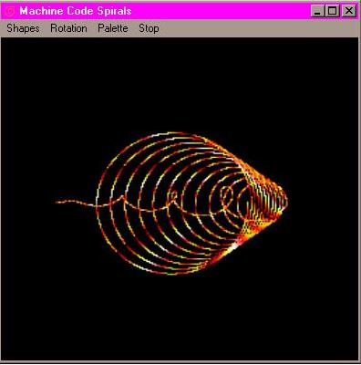



## Spirals

### Description

Spirals by Robert Rayment. Chris and I were looking at some spirals and I've animated a few for your pleasure (if you like that kind of thing!). See 'Tunnels & Things' for the techniques. Win98 only. Zip file 24 KB.
 
### More Info
 
Uses assembler. Just run

             |
---                |---
**Submitted On**   |2001-03-17 09:53:18
**By**             |[Robert Rayment](https://github.com/Planet-Source-Code/PSCIndex/blob/master/ByAuthor/robert-rayment.md)
**Level**          |Advanced
**User Rating**    |5.0 (30 globes from 6 users)
**Compatibility**  |VB 6\.0
**Category**       |[Graphics](https://github.com/Planet-Source-Code/PSCIndex/blob/master/ByCategory/graphics__1-46.md)
**World**          |[Visual Basic](https://github.com/Planet-Source-Code/PSCIndex/blob/master/ByWorld/visual-basic.md)
**Archive File**   |[CODE\_UPLOAD171763172001\.zip](https://github.com/Planet-Source-Code/robert-rayment-spirals__1-21707/archive/master.zip)

### API Declarations

A couple

